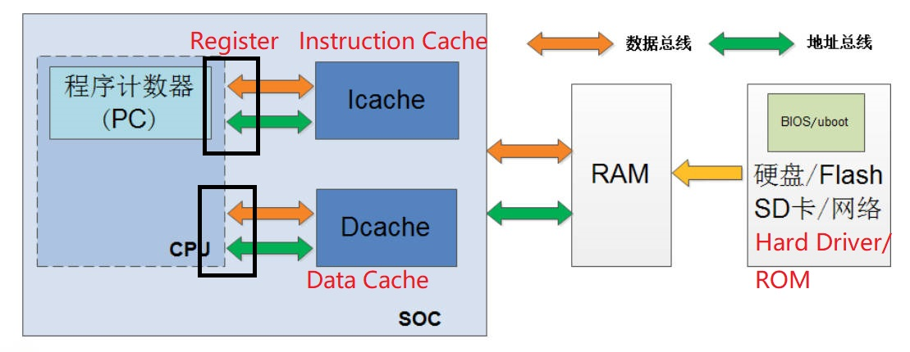

# 2.1 Computer Architecture

## Von Neumann Architecture

Programs are mixed and stored in the computer's internal memory like data

## Harvard Architecture

Parallel architecture: Instructions and data are stored independently

## Modern Computer System

The Cache layer inside the CPU adopts the Harvard structure, and the outside of the CPU adopts Von Neumann

