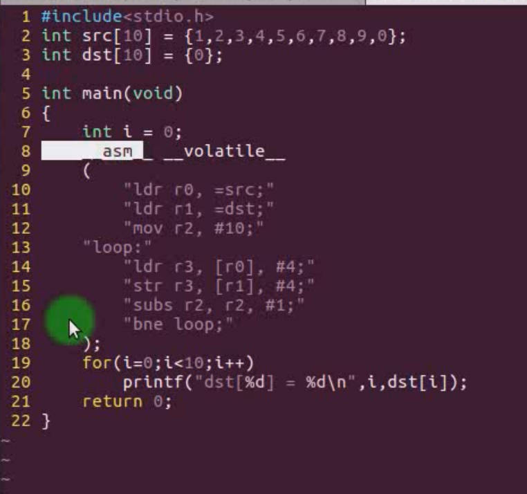

# 2.10 C and assembly mixed programming

## ATPCS rules

### ATPCS：ARM-Thumb Procedure Call Standard 

Assembly language can mix with C language if it follows the ATPCS rules, the variables inside can call each other.

### 	stack usage rules
​			– Use full decrement FD stack, push and pop operations use LDMFD/STMFD

​    **Basic rules for subroutine calls**
​			• Pass parameters and return results between subroutines through registers R0-R3, if there are more than 4 parameters, the rest use the stack to pass parameters
​			• Use R4-R11 to save local variables in subroutines
​			• R12 is used as a temporary register in the process call to save SP, denoted as IP
​			• R13 is used as the data stack pointer, denoted as sp
​			• R14 is used as a connection register, denoted as lr, to save the return address of the subroutine
​			• R15 is used as a program counter, denoted as pc

------

## ARM Compiler Inline Assembly

• The ARM compiler uses **__asm** to inline assembly language in C under the ATPCS rules

```
# include<stdio.h>
# include<stdlib.h>
....
int main()
{
	int a;
	....
		__asm
		{
		Instructions/*Explain*/
		…
		[Instructions]
		}
	....
	return 0;
}
```


------

## GNU inline assembler

### keyword __asm__

​	The GNU compiler uses __asm__ to modify the ANSI C extension, indicating that the following code is inline assembly, and then you can choose to use __volatile__ to tell the compiler without optimizing the code.

```
 __asm__ __volatile__
(
	“Assembly Language;"
	...
	"Assembly Language;"
• );
```



------

## Calling a C subroutine in assembly

### Instructions

​	• Complete parameter transfer according to ATPCS parameter rules
​	• Satisfy the stack environment that C language can pass parameters and save local variables
​	• Just use **BL** funcntion to call the C language function.

### C program call with less than 4 arguments


### Function calls with more than 4 arguments

