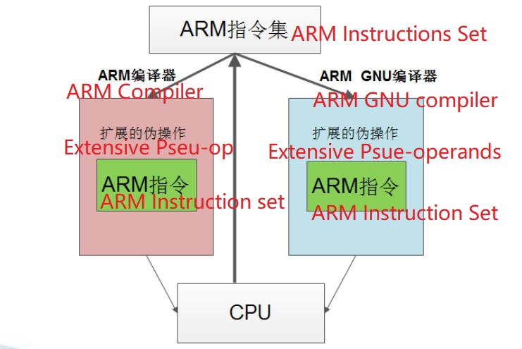

# 2.11 GNU ARM Assembly Language


## ARM and GNU Compilers

### Commonly used ARM development environment

• IAR
• ADS1.2/SDT: ARM Software Development Kit
• RVDS: Realview Developer Suite
• Keil MDK:
• RealView MDK
• GNU ARM cross compiler (arm-linux-gnueabi-gcc)

### ARM Compiler

• GNU arm-linux-gcc compiler

------

## Difference between ARM compiler and GNU compiler

### Reference standard for compiler design: ARM instruction set

ARM instruction set is the kernel for all difference compilers



------

## Pseudo-op differences between compilers

| ARM Compiler        | GNU ARM Compiler    |
| ------------------- | ------------------- |
| AREA copy, CODE, …  | .text               |
| AREA , dat, DATA,…  | .data               |
| ; for explain       | /**/ or @           |
| DCD                 | .long .word         |
| Entry               | Entry :             |
| END                 | .end                |
| CODE32              | .arm/.code 32       |
| CODE16              | .thumb/.code 16     |
| SPACE               | .space              |
| GBLL/GBLA           | .global             |
| EXPORT              | .global             |
| IMPORT              | .extern             |
| EQU/SETL/SETA       | equ /.set           |
| label               | label:              |
| :OR:                | \|                  |
| :SHL:               | <<                  |
| IF :DEF: ELSE ENDIF | .ifdef .else .endif |
| MACRO               | .macro              |
| MEND                | .endm               |
| GET test.h          | .include “test.h”   |

## Commonly used pseudo-operations in GNU ARM assembly

| Pseudo-ops                       | Explain                                    |
| -------------------------------- | ------------------------------------------ |
| ENTRY(_start)                    | Define program entry                       |
| @                                | Explain                                    |
| .section .text/.data             | Define section                             |
| .align                           | address alignment                          |
| .quad/.long/.word/. byte/.short/ | integer data definition                    |
| .string/.ascii /.asciz           | string definition                          |
| .float                           | Float definition                           |
| .space 10 FF                     | Allocate 10 bytes of space, filled with FF |
| .equ/.set                        | assignment statement                       |
| .type func ,@function            | specifies the symbol type as a function    |
| .type num ,@object               | specifies the symbol type as object        |
| .include/.incbin                 | Expand headers/binaries                    |
| tmp .reg/.unreg r12              | alias the register                         |

| Pseudo-ops                        | Explain                                       |
| --------------------------------- | --------------------------------------------- |
| .arm/.code32                      | Specifies the instruction set format          |
| .thumb/.code16                    | Specifies the instruction set format          |
| .pool/.ltorg                      | Declare a literal pool                        |
| .comm buf,20                      | Apply for a section of buf in the BSS section |
| OUTPUT_ARCH(arm)                  | Specify the executable file running platform  |
| OUTPUT_FORMAT("e lf32-littlearm") | Specifies the output executable format        |
| ; / \n\t                          | assembly statement delimiter                  |
| \# / $                            | The Predix of the direct data                 |
| .arch                             | Define the version of Instruction Set         |
| .file                             | Compile the corresponding C source file       |
| .fpu                              | floating point type                           |

------

## Labels in GNU assembly

### rules of use

• Consists of letters, numbers, underscores, and . characters
• A local label consists of a number N, quoted: Nf or Nb, indicating forward or backward search

**Program start label: _start**:

• GNU ARM assembler uses the **_start** label by default as the starting point of the assembler
• If you want the label to be referenced by other files, you need to declare it in .global _start

------

## .section pseudo-operation

Instructions
• Users can customize a section through the **.section** pseudo-operation
• Format: **.section <section_name> {,"<flags>"}**

```
 .section .mysection “awx”  @defines an allowable, writable, executable section
```

• Each section starts with a section name and ends with the next section name or the end of the file
• The section names reserved by the system cannot conflict: .text/.data/.bss/…

------

## data definition

basic format
	• Label: command
	• f:
	• .float 3.14
	• Symbol assignment: .equ i,10
	• Define static symbols
	• In addition to assignment, **.equ can be used to define constants that can be used in code segments**, Just like the #define in C
The symbols used are similar to the #define macro definition in C language

```ARM GNU
	.section .data
	.equ DELAY, 100
	.section .text
	mov R0, $DELAY
```

