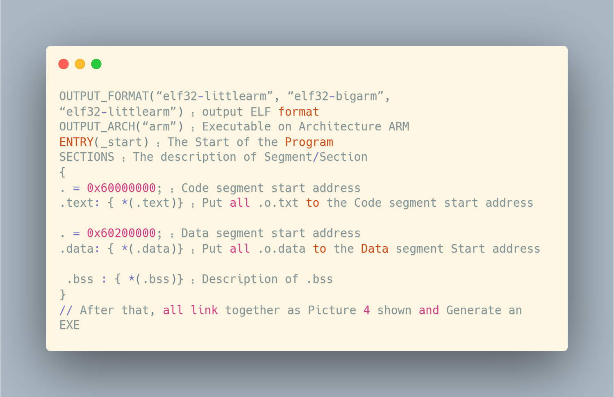
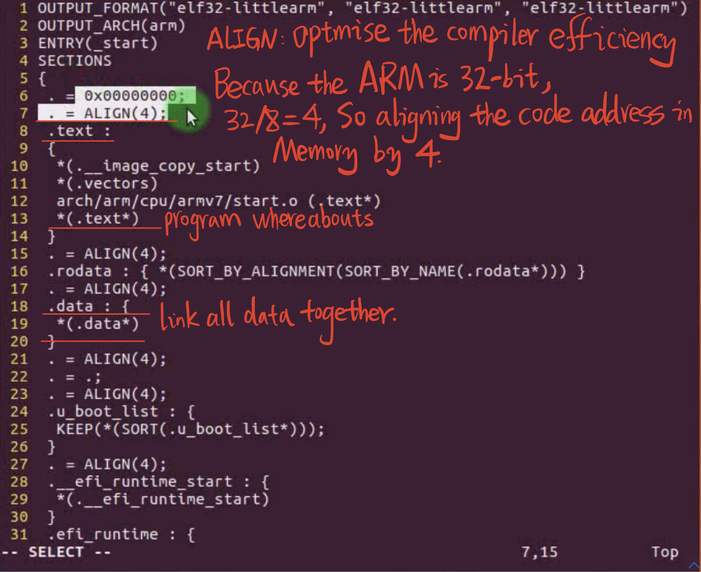
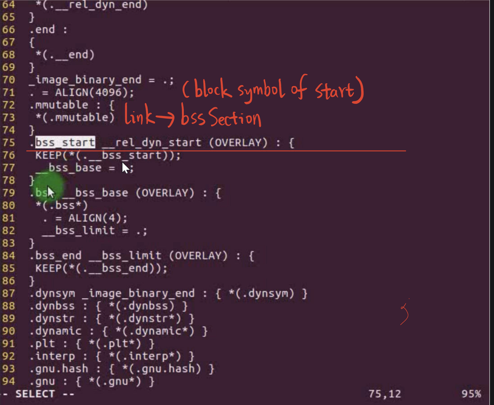

# 2.12 Link script

## Compile and link the program

## Compilation process

​	• The compiler compiles in units of source files
​	• One C file corresponds to one object .o file
​	• One assembly .S file corresponds to one .o file

### linking process

​	• Linking assembles the individual .o files into an executable
​	• Assembly of identical segments
​	• Add the necessary file headers, calling as bss section.

------

## Link Script

How are the different code segments assembled?
	• The link script specifies the assembly order, starting address, position alignment, etc. of each segment
	• Specifies the format, platform and other information of the output executable file
	• Linker assembles from linker script

## linker script example

Embedded development, especially bare metal and assembly development, must be linked to a specified location, need to display a specified link script, or even write a link script by yourself

In the GNU Linux environment, the link script is generally xxx.lds, otherwise under Uboot, the link script is U-boot.lds

------

## Analyzing u-boot.lds

