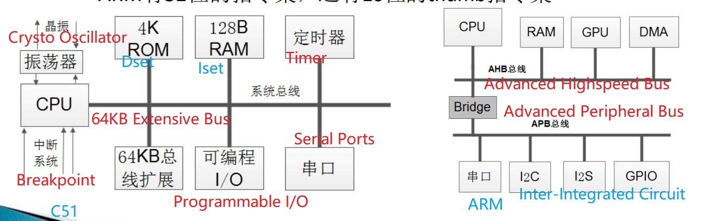
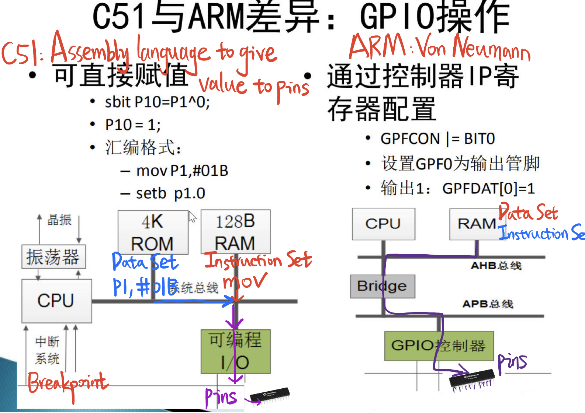

# 2.3 Comparative analysis of C51 and ARM architecture

C51: Harvard architecture

ARM: Von Neuman architecture

GPIO: **pins** along the top edge of the board. GPIO stands for General-Purpose Input/Output.

**ARM Architecture:** GPIO (General Purpose Input Output) , Using pins to communicate outside

