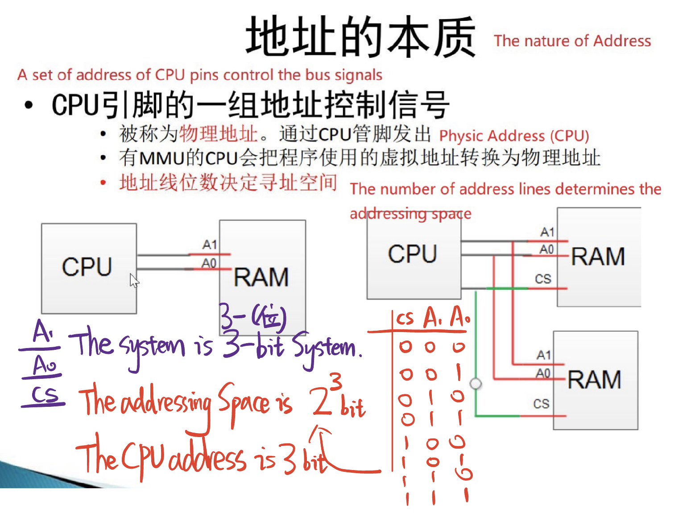
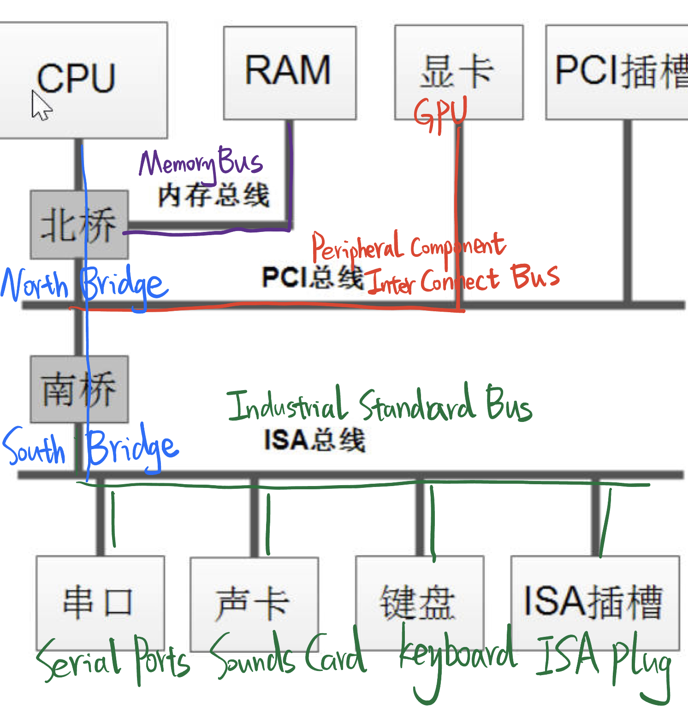
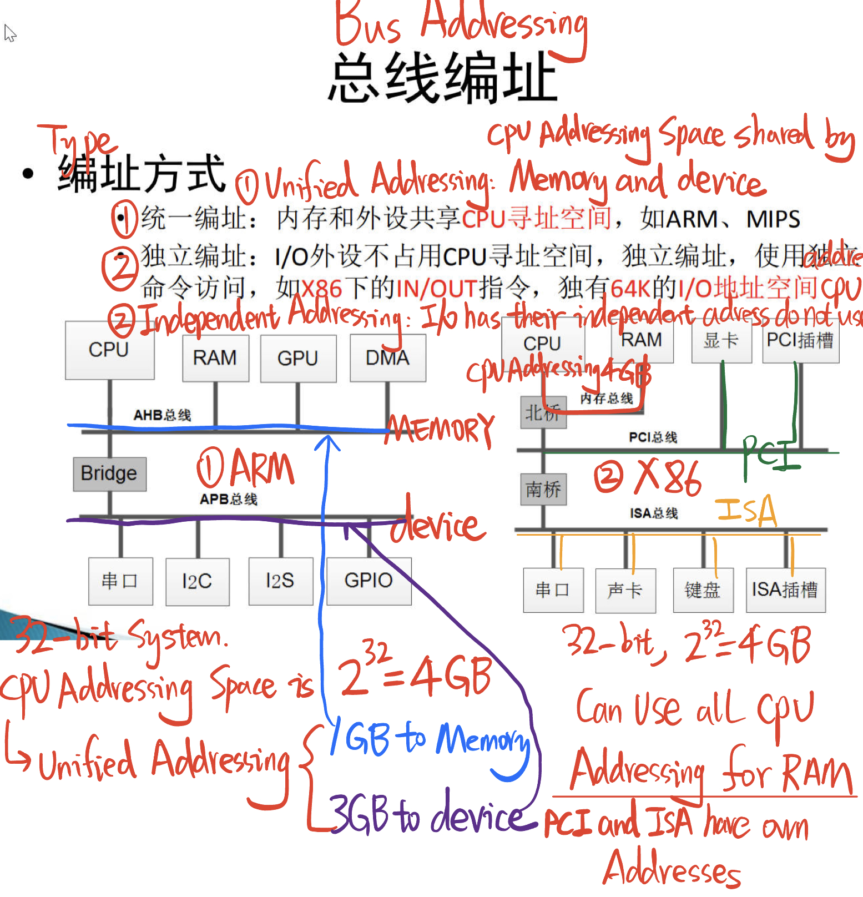

# 2.4 Bus and Address

## HOW do CPU reads the RAM from CPU Physic address

## The concept of BUS: A collection of various digital signals

## 总线的概念: 各种数字信号的集合

Component: 

​	Address signal

​	Input/Output

​	Control signal

​	Provides powder to the device on the Bus

### X86:

## The two Types of Bus Addressing

