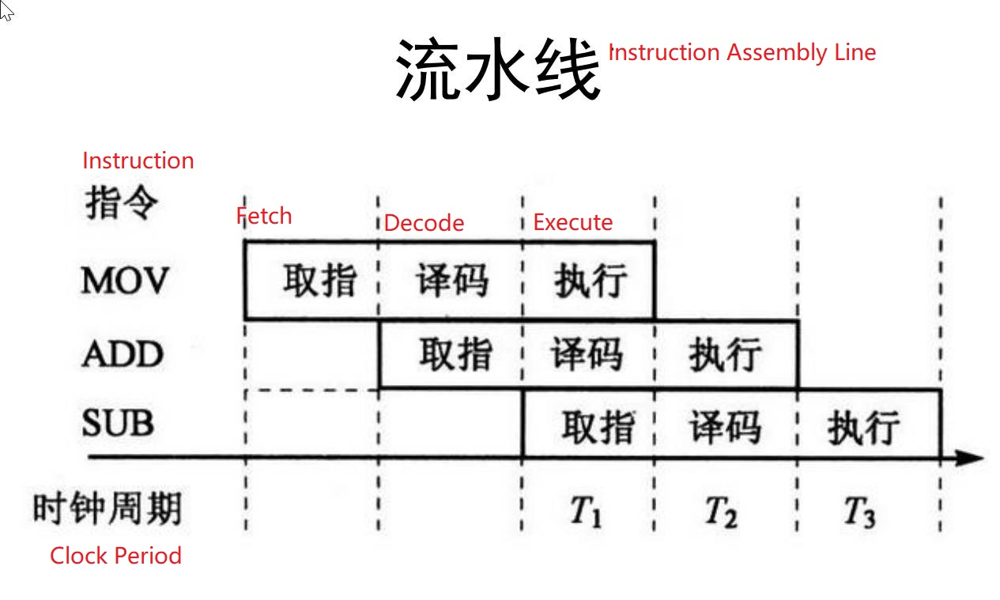
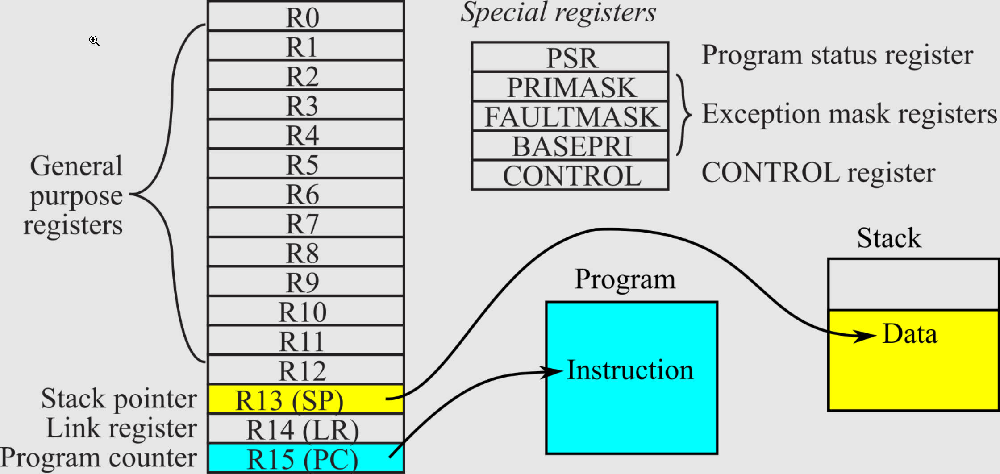
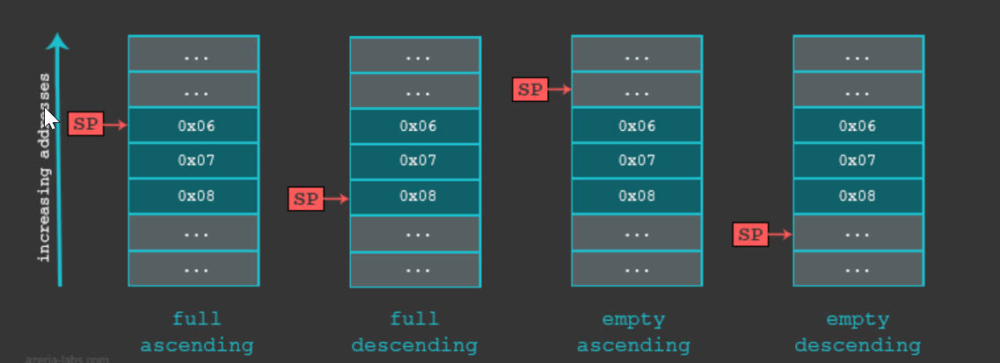

# 2.6 ARM Architecture and Instructions


## ARM architecture

### **reduced instruction set computer** (RISC)

• Load/store architecture, can only process register data

• Fixed Instruction Length, Single Cycle Instructions

### There are some differences between ARM instruction set and RISC

• Barrel shift register: complete various shift operations of data in a single cycle

Thumb instruction set: Compressed form of 32-bit ARM instruction set to improve code density




## Register

### general purpose register

• R0—R12: R0-R3 are used to transfer function parameters, R4-R11 are used to save subroutines
The local variables of the sequence, R12 is often used as a temporary register during the call
• **Program counter: R15 (PC)**, can not be used for other purposes, instruction fetch address
Needle, its **value = current memory instruction execution address + 8**

### status register

CPSR: current processor state

### Separate registers for each mode

• Stack register: R13 (SP), R13 cannot be used for other purposes in subroutines
• Link register: R14 (LR), holds the return address of the subroutine
• In FIQ working mode, it has its own R8-R12 registers
• SPSR: used to save the working state of CPSR, there is a register in each mode




# ARM addressing mode


## register addressing

• MOV R1, R2; move the value of R2 into R1

• SUB R0, R1, R2; R1-R2, save the result to R0

## Immediate Addressing

• MOV R0, #0xFF00: The immediate value is prefixed with #, 0x means hexadecimal

## Register Offset Addressing

• MOV R0, R2, LSL, #3; R2 shifted left by 3 bits and give value to R0

| LSL     | logical shift left          |
| ------- | --------------------------- |
| LSR     | logical shift right         |
| ASR/ASL | Arithmetic shift right/left |
| ROR/ROL | Cycle right/left            |
| RRX     | Rotate right with extension |

## **register indirect addressing**

**[ ]**

**LDR R1，[R2] : Use the value in R2 as the memory address, take out the data in the memory address and send it to R1**

## base addressing 基址寻址

• The value in the register is added to the given offset + address
• fetch the value at this address
• Commonly used in lookup tables, array operations, and functional unit register access 常用于数组
• Divided into pre-index and post-index base addressing

STR R1，[R0，#-2] ： First subtract 2 from the value in R0 as the memory address, and then write the value of R1 to this address

STR R1，[R0],#2 ：First use the value in R0 as the memory address, write the value in R1 to this address, and then add 2 to R0

LDR R2，[R3，#0x03] ： Add 0x03 to the value in R3 as the memory address, take out the value in this address and give it to R2

## multiple register addressing

• Several register values can be transferred at a time

LDMIA R1!,{R2-R7,R12} : Read the data in R1 address unit to R2-R7, R12, R1 automatically add

## stack addressing

### Operation of the stack in ARM

Subroutine local variable storage and parameter passing are done through the stack

The operation of the stack in ARM is completed through the cooperation of **STM/LDM** and **stack pointer SP**

The type of stack used by ARM is a **full decrement stack**

**Decrement** stack D: grow downward, grow towards lower address

**Full stack** F: SP stack pointer points to the top element of the stack



STMFD SP!,{R1-R7,LR} : Push R1-R7, LR into the stack. full decrement stack

LDMFD SP!,{R1-R7,LR} : Data is popped out, popped to R1-R7, LR, full decrement stack

**STMFD/LDMFD helps ARM stack store and load subroutine arguments**


## relative addressing 相对寻址

The PC is used as the base address, and the address code segment in the instruction is used as the offset

Instruction : B, BL, ADR

```
...
• B LOOP
• ...
• LOOP MOV R0,#1
• MOV R1,R0
• ...

```

ADD PC, PC, #OFFSET : Where OFFSET is the offset between the B LOOP instruction address and the LOOP label address

Practical: **GCC -fPIC** to generate code regardless of the position in the memory.

