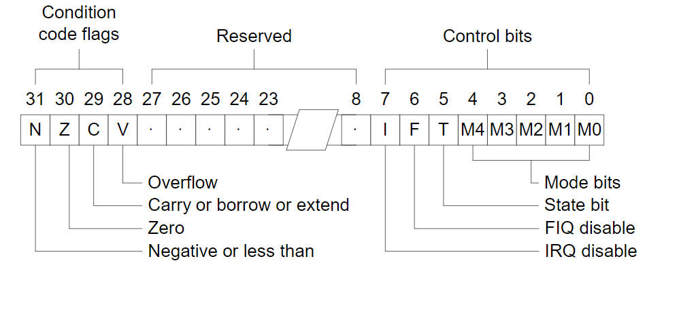
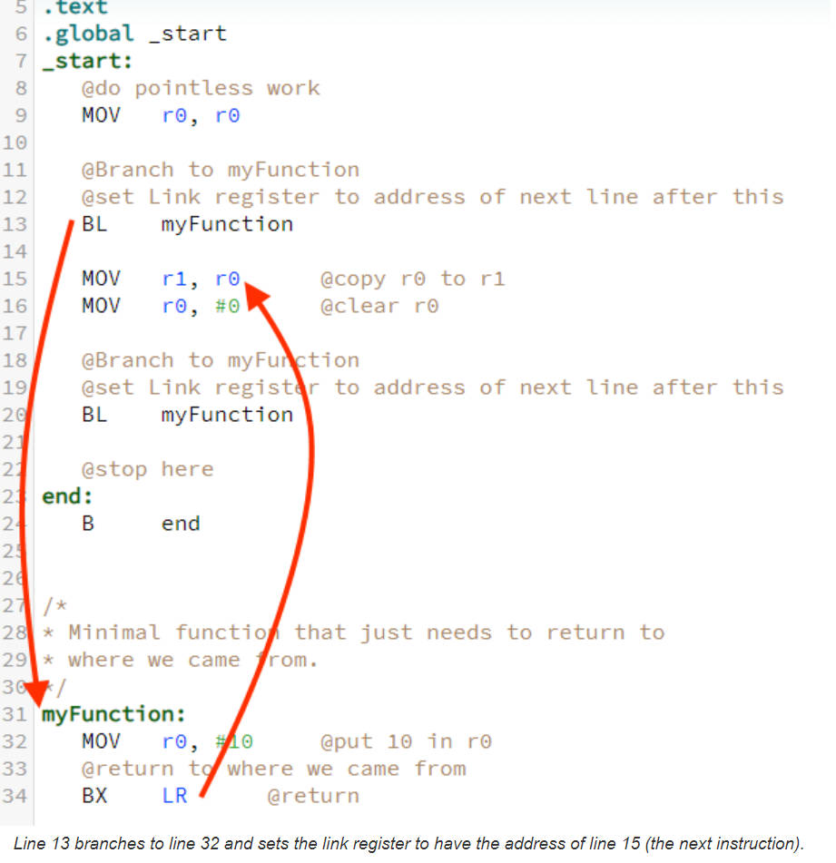

# 2.7 ARM assembly instructions

## Instruction command format

•  **<opcode>{ <cond> {s}<Rn> , <Rd>{,<operand2>}}**

<opcode> is a mnemonic, such as LDR, STR etc

<> is required, {} is optional.

cond: condition for execution

 S: whether count the value of **CPSR(Condition Process Status Register)**

Rd: destination register

Rn: Register for first operand

**CPSR register** (Conditional Process Status Register):

## memory access instruction Command

### load/store architecture

ARM is a RISC structure and cannot directly operate on stored data.
Loaded into registers for processing. Memory access is implemented using the load instruction **LDR** and store instruction **STR**

### Basic Command

LDR R1，[R0]；Use the R0 value as the memory address, take out the address value and save it to R1

STR R1，[R0]；Save the value of R1 to the memory location whose address is the value in R0

LDRB/STRB: read a byte

LDM/STM：Implement data transfer between a set of registers and contiguous memory units

SWP R1，R1，[R0]: Exchange the content of the storage unit pointed to by R1 and R0

SWP R1，R2，[R0]：Read [R0] to R1, write R2 to [R0] memory cell

"LDMFD" is the mnemonic for "Load Multiple Registers from Full Descending Stack."

"SP!" refers to the stack pointer (SP)

The "LDMFD SP!, {R0-R2,R14}" instruction loads the values of registers R0, R1, R2, and R14 from the stack into their respective registers. The "FD" in "LDMFD" indicates a full descending stack operation, which means that the stack pointer will be automatically updated to point to the next location after the loaded registers.

## data transfer command

MOV R1，#1；Transfer immediate value 1 to register R1

MOV R1，R0；Transfer the value in R0 to the R1 register

MOV PC，LR: subroutine return

MVN R1，#0xFF；Invert 0xFF and assign it to R1

## Arithmetic Logic Operation Instructions

### Addition & Subtraction&NOR&XOR&Clear

• ADD R1, R1, #1; R1=R1+1
• ADC R1, R1, #1; R1=R1+1+c (C flag in CPSR)
• SUB R1, R1, R2; R1=R1-R2
• SBC R1, R1, R2; R1=R1-R2-c
• AND R0, R0, #3; keep bit0 and 1 of R0, and clear other bits
• ORR R0, R0, #3; set bit0 and bit1 of R0
• EOR R0, R0, #3; invert bit0 and bit1 in R0
• BIC R0, R0, #3; clear bit0 and bit1 in R0

## multiplication instruction Command

• MUL R2，R1，R0； R2=R1*R0 

• MLA R3，R2，R1，R0； R3=R2*R1+R0

## comparison instruction

Affects N, Z, C, V of the CPSR status register

• CMP R1, #10; R1-10, results affect N, Z, C, V bits
• CMP R1, R2; R1-R2, results affect N, Z, C, V bits
• CMN R0, #1; R0-(-1) comparison takes a negative value, negative comparison
• TST R1, #1; R1&1 bit test
• TEQ R1, R0; R1^R0 tests for equality

## Conditional Execution

• Almost all ARM instructions can be executed conditionally based on **CPSR register** flag bits such as Picture 1, **the flag "s"**
• Conditional execution, reducing the number of branch instructions and increasing code density: BEQ, BNE

| Conditional Code | CPSR Flag      | Meaning                           |
| ---------------- | -------------- | --------------------------------- |
| EQ               | Z = 1          | Equality                          |
| NE               | Z = 0          | Not Equality                      |
| CS/HS            | C = 1          | unsigned greater than or equal to |
| CC/LO            | C=0            | unsigned less than                |
| MI               | N set          | Negatives                         |
| PL               | N cleared      | positive or zero                  |
| VS               | V set          | overflow                          |
| VC               | V clear        | unoverflow                        |
| HI               | C set, Z clear | Unsigned greater than             |
| LS               | C clear, Z set | Unsigned less or equal            |
| GE               | N = V          | Signed greater or equal           |
| LT               | N !=V          | Unsigned less                     |
| GT               | Z clear, N = V | Signed greater than               |
| LE               | Z set, N != V  | Unsigned less or equal            |
| AL               | omit           | Unconditional Execution           |
| NV               | omit           | Never Execution                   |

## Branch and Jump Instruction

## [Branch and Jump Instructions](https://www.doc.ic.ac.uk/lab/secondyear/spim/node16.html)

• B label; means branchto,  jump to label, jump range [0,32M]
        CMP R2, #0
        BEQ label
• BL label; jump with link, first save the next instruction to LR, and then jump
• MOV PC, LR ; usually used for function calls and then returns from subroutines
back
• BX LR; Branch and eXchange instruction set: Branches to the address stored in register *rd*. To return after a BL instruction, we can use lr as the register. The eXchange refers to the fact that we can use this instruction to switch from 32-bit arm instructions to 16-bit thumb instructions, but we will not be using that feature.
• BLX label; with links and state toggle jumps

Reference: http://computerscience.chemeketa.edu/armTutorial/Functions/BranchLink.html

