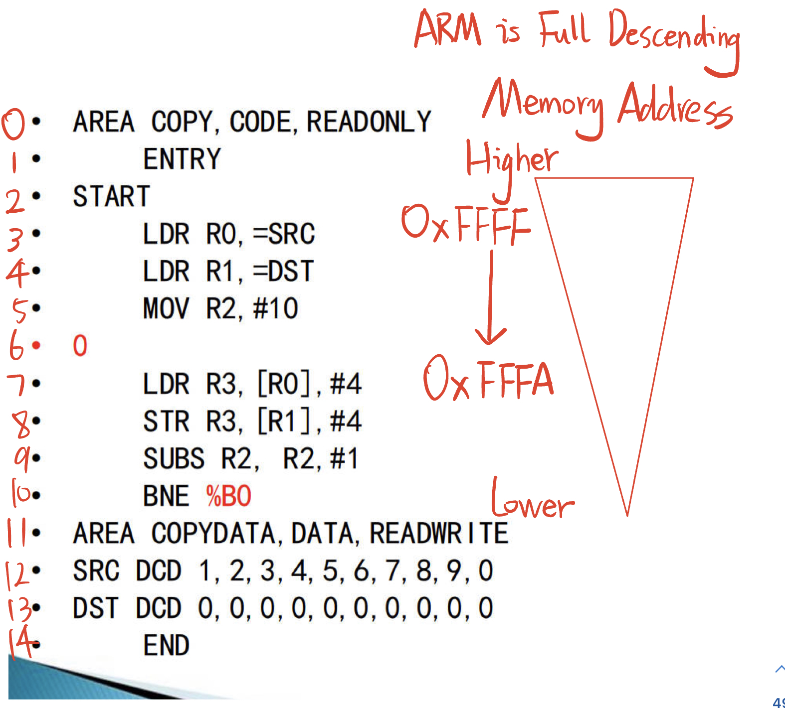

# 2.9 ARM assembler and pseudo-ops


## Assembly language program format

**• Organize source files in units of sections（段）**
• Divided into **code segment** and **data segment**, the segments are independent of each other
• An ARM assembler requires at least one code segment, identified using the AREA pseudo-op
The start of a segment, the segment name and attributes.
• Use the pseudo-operation ENTRY to identify the first instruction executed by the program
• Use the pseudo-operation END to mark the end of the assembler
• label
• Notes

## Copy


```
LDR R0,=SRC   ; Load the address of SRC into R0
LDR R1,=DST   ; Load the address of DST into R1
MOV R2,#10    ; Set the loop counter to 10

LOOP:
LDR R3,[R0],#4 ; Load a word from the address stored in R0 (source) and increment R0 by 4 bytes
STR R3,[R1],#4 ; Store the word into the address stored in R1 (destination) and increment R1 by 4 bytes
SUBS R2,R2,#1 ; Decrement the loop counter
BNE LOOP      ; Branch back to LOOP if the loop counter is not zero

```

define two arrays: `SRC` and `DST`. These arrays are initialized with a sequence of values using the `DCD` directive, which stands for "Define Constant Doubleword".

In the line `SRC DCD 1,2,3,4,5,6,7,8,9,0`, the `SRC` array is initialized with the values `1,2,3,4,5,6,7,8,9,0`. Each value is a 32-bit doubleword (4 bytes).

Similarly, the line `DST DCD 0,0,0,0,0,0,0,0,0,0` initializes the `DST` array with ten 0 values.

Therefore, after executing the copy operation, the `DST` array will contain the same values as the `SRC` array.

------

## Symbols and Labels

### Definition of symbols
• In ARM assembly, use symbols to represent addresses, variables and numeric constants
**• When a symbol is used to identify an address, it is also called a label**

### local label

#### features
• Address references by numbers [0,99] instead of using names (characters)
• scoped to the current segment
• Quotation format: **%{F|B|A|T} N{routname}**
     »F: instructs the compiler to search forward only
     »B: instructs the compiler to search only backwards
     »A: instructs the compiler to search all nesting levels of the macro
     » T : instructs the compiler to search the current level of the macro
     »routename: local label scope name, defined using ROUT
     »If B and F are not specified, the compiler will search backward first, and then search forward



------


## Pseudo Operation

• Some special instruction mnemonics in ARM assembly language
• The main purpose is to perform various processing on the assembly source program instructions and assemble them into a complete assembly program
• The pseudo-operation is for the assembler, similar to the macro in C language, it is for the compiler. After preprocessing, macros disappear; after assembly, pseudo-ops disappear.
• Different compilation environments may have different pseudo-operation formats.

### Commonly used pseudo-operations

• Symbol definition pseudo-ops: **GBLA, LCLA…**
• Data definition pseudo-operations: **DCD, DCB, SPACE**
• Assembler control pseudo-ops: **AREA, ENTRY, MACRO, MEND**

------

## Symbol Definition Common Pseudo-Operations

| Pseudo Ops | Example            | Explain                                                      |
| ---------- | ------------------ | ------------------------------------------------------------ |
| GBLA       | GBLA a             | Define a global arithmetic variable a and initialize it to 0 |
| GBLL       | GBLL a             | Define a global logical variable a and initialize it to {FALSE} |
| GBLS       | GBLS str           | Define a global string variable str and initialize it to " " |
| LCLA/L/S   | LCLA/L/S a         | Define a local arithmetic/logic/string variable              |
| SETA       | num SETA 20        | Assign the value 20 to the arithmetic variable               |
| SETL       | bool SETL {TRUE}   | Assign the value {TRUE} to the logical variable bool         |
| SETS       | str SETS “hello”   | Assign hello to the string variable str                      |
| RLIST      | ArReg RLIST{R0-R3} | Define the name of the register list as ArReg, which can be accessed through LDM/STM |

## Data Definition Pseudo-Operations

| Pseudo Ops | Example                 | Explain                                                      |
| ---------- | ----------------------- | ------------------------------------------------------------ |
| DCD        | num DCD 0x11223344      | Specifies that the compiler allocates one or more words, 4-byte aligned |
| DCDU       | DCDU0xFFEE11FF          | Does not require border alignment                            |
| DCB        | DCB ‘A’                 | Allocate one or more bytes of space                          |
| SPACE      | Buf SPACE 100           | Allocate a continuous space and initialize it to 0           |
| MAP        | MAP 0x30009000          | Define the first address of a structured memory table        |
| FIELD      | a FIELD 4 / str FIELD 8 | Defines a data field in a structured memory table            |

## Assembler Control Pseudo-Operations

| Pseudo-ops         | Explain                                           |
| ------------------ | ------------------------------------------------- |
| IF，ELSE，ENDIF    | conditional assembly                              |
| WHILE，WEND        | Repeatedly assemble the same piece of source code |
| MACRO，MEND，MEXIT | Define Macro                                      |

## Commonly used pseudo-operations

| Psuedo-ops    | Explain                                                      |
| ------------- | ------------------------------------------------------------ |
| ALIGN         | Make the current position satisfy a certain byte alignment   |
| AREA          | Indicates the start of an assembler code segment or data segment |
| CODE16        | Instructs the compiler that the following instructions are thumb instructions |
| CODE32        | Indicates that the instructions following the compiler are arm instructions |
| ENTRY         | Specifies the entry point of the program                     |
| EQU           | Define a symbolic name for a constant, similar to a macro    |
| END           | The assembler source program ends                            |
| EXPORT/GLOBAL | Declare a symbol can be referenced by other files            |
| IMPORT/EXTERN | Give the inner symbol for outer use                          |
| GET/INCLUDE   | Include an outside files                                     |

